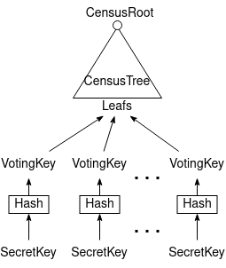
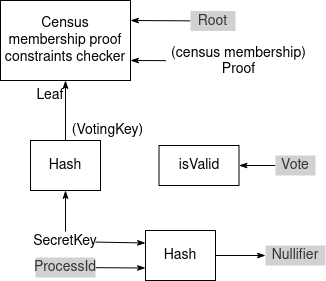

# ark-anon-vote 

Experimental implementation of onchain anonymous voting using [arkworks](https://arkworks.rs), following a similar design done in [vocdoni/zk-franchise-proof](https://github.com/vocdoni/zk-franchise-proof-circuit) and [aragonzkresearch/oav](https://github.com/aragonzkresearch/ovote/blob/main/circuits/src/oav.circom) (which are done in Circom).

## Scheme
The main idea is that users send their vote + zk-proof to the smart contract, proving that they belong to the census and that their vote has not been already casted.

Each user generates a random *SecretKey*, and computes the corresponding *VotingKey* by hashing it.
The census creator adds all the *VotingKeys* as leafs in the census tree, obtaining the *CensusRoot*:

Each user computes a zk-proof which will be verified onchain, proving that they know a *SecretKey* corresponding to a *VotingKey* (without revealing any of both), which is placed in some *CensusTree* leaf (without revealing which one) under the *CensusRoot*. Also proves that their *SecretKey* hashed together with the *ProcessId* leads to the given *Nullifier*, in order to prevent proof reusability.

Constraints system (grey background indicates public inputs):

